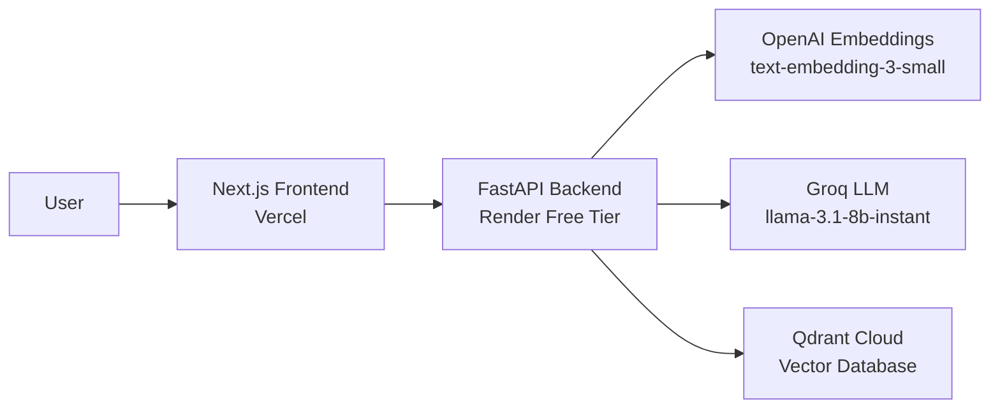

# Medical RAG Agent 🏥

A production-ready, HIPAA-inspired RAG (Retrieval Augmented Generation) system for medical document analysis with automated PHI redaction, deployed on entirely free infrastructure.

[](https://medical-rag-agent.vercel.app)
[](LICENSE)

## 🚀 Live Demo

**Frontend:** [https://medical-rag-agent.vercel.app](https://medical-rag-agent.vercel.app)  
**Backend API:** [https://medical-rag-backend-mnee.onrender.com](https://medical-rag-backend-mnee.onrender.com)

## ✨ Features

- 📄 **PDF Upload & Processing** - Extract and analyze medical documents
- 🔒 **PHI Redaction** - Automatic removal of sensitive information (email, phone, SSN, dates)
- 🧠 **Semantic Search** - Qdrant vector database with OpenAI embeddings
- 💬 **Streaming Chat** - Real-time responses powered by Groq's Llama 3.1
- 🔐 **Authentication** - Secure user management with Clerk
- ⚡ **Free Tier Deployment** - Optimized to run on Render's 512MB free tier

## 🏗️ Architecture



### Tech Stack

**Frontend**
- Next.js 15 with App Router
- shadcn/ui components
- Clerk Authentication
- React Markdown

**Backend**
- FastAPI with async support
- Streaming responses
- Rate limiting (SlowAPI)
- Structured logging (structlog)

**AI/ML**
- **Embeddings:** OpenAI `text-embedding-3-small` (1536 dims)
- **LLM:** Groq `llama-3.1-8b-instant` (free tier)
- **Vector Store:** Qdrant Cloud (free tier)
- **Redaction:** Regex-based PHI pattern matching

## 📦 Installation

### Prerequisites
- Python 3.11+
- Node.js 18+
- Docker (for local development)

### Local Development

1. **Clone the repository**
```bash
git clone https://github.com/Balavardhanreddysheelam/Medical_rag_agent.git
cd Medical_rag_agent
```

2. **Backend Setup**
```bash
cd backend
python -m venv venv
source venv/bin/activate  # Windows: venv\Scripts\activate
pip install -r requirements-prod.txt
```

3. **Environment Variables**

Create `backend/.env`:
```env
GROQ_API_KEY=your_groq_key
OPENAI_API_KEY=your_openai_key
QDRANT_URL=your_qdrant_url
QDRANT_API_KEY=your_qdrant_key
CLERK_SECRET_KEY=your_clerk_secret
```

4. **Frontend Setup**
```bash
cd frontend
npm install
```

Create `frontend/.env.local`:
```env
NEXT_PUBLIC_API_URL=http://localhost:8000
NEXT_PUBLIC_CLERK_PUBLISHABLE_KEY=your_clerk_publishable_key
CLERK_SECRET_KEY=your_clerk_secret
```

5. **Run Locally**
```bash
# Terminal 1 - Backend
cd backend
uvicorn app.main:app --reload

# Terminal 2 - Frontend
cd frontend
npm run dev
```

Visit `http://localhost:3000`

## 🚀 Deployment

### Backend (Render)

1. **Fork this repository**
2. **Create a new Web Service** on [Render](https://render.com)
3. **Connect your GitHub repository**
4. **Configure Environment Variables:**
   - `GROQ_API_KEY`
   - `OPENAI_API_KEY`
   - `QDRANT_URL`
   - `QDRANT_API_KEY`
   - `CLERK_SECRET_KEY` / `CLERK_PUBLISHABLE_KEY`
   - `USE_FASTEMBED=false`
   - `USE_CLOUD_EMBEDDINGS=false`

5. **Deploy** - Render will automatically use `render.yaml`

### Frontend (Vercel)

1. **Import project** to [Vercel](https://vercel.com)
2. **Configure Environment Variables:**
   - `NEXT_PUBLIC_API_URL` (your Render backend URL)
   - `NEXT_PUBLIC_CLERK_PUBLISHABLE_KEY`
   - `CLERK_SECRET_KEY`

3. **Deploy** - Vercel will auto-detect Next.js

### External Services

**Qdrant Cloud** (Free Tier)
1. Create cluster at [cloud.qdrant.io](https://cloud.qdrant.io)
2. Copy cluster URL and API key

**OpenAI** (Pay-as-you-go)
1. Add credits at [platform.openai.com](https://platform.openai.com)
2. Generate API key (~$5-10 credits recommended)

**Groq** (Free)
1. Get API key at [console.groq.com](https://console.groq.com)

**Clerk** (Free)
1. Create app at [clerk.com](https://clerk.com)
2. Copy publishable and secret keys

## 💡 Usage

1. **Sign In** with Clerk authentication
2. **Upload** a medical PDF (patient records, research papers, etc.)
3. **Wait** for processing (PHI redaction + embedding generation)
4. **Ask questions** about the document in the chat interface
5. **Get answers** with real-time streaming responses

## 🔧 Optimization Details

### Memory Optimization (512MB → ~150MB)

To fit Render's free tier, we removed:
- ❌ `ragas` + `datasets` (~300MB)
- ❌ `spacy` + models (~70MB)
- ❌ `fastembed` + models (~100MB)
- ❌ `langchain-huggingface` (~50MB)

Replaced with:
- ✅ OpenAI Cloud Embeddings (zero local memory)
- ✅ Regex-based PHI redaction (lightweight)
- ✅ Minimal dependencies

### Cost Breakdown

| Service | Tier | Monthly Cost |
|---------|------|--------------|
| Render | Free | $0 |
| Vercel | Hobby | $0 |
| Qdrant Cloud | Free | $0 |
| Groq API | Free | $0 |
| OpenAI Embeddings | Usage | ~$0.01 per doc |
| **Total** | | **~$0** |

## 📊 Performance

- **Upload Time:** ~2-5 seconds per document
- **Query Latency:** <1 second (streaming starts)
- **Memory Usage:** ~100-150MB (Render free tier)
- **Concurrent Users:** Limited by free tier rate limits

## 🛡️ Security & Privacy

- ✅ Automated PHI redaction (EMAIL, PHONE, SSN, DATE patterns)
- ✅ Clerk authentication with session management
- ✅ CORS configured for secure cross-origin requests
- ✅ API keys stored as environment variables
- ⚠️ **Note:** This is a portfolio project, not HIPAA-compliant for production use

## 🤝 Contributing

Contributions are welcome! Please feel free to submit a Pull Request.

## 📝 License

This project is licensed under the MIT License - see the [LICENSE](LICENSE) file for details.

## 🙏 Acknowledgments

- [LangChain](https://langchain.com) for RAG framework
- [Groq](https://groq.com) for free LLM inference
- [OpenAI](https://openai.com) for reliable embeddings
- [Qdrant](https://qdrant.tech) for vector database
- [Render](https://render.com) & [Vercel](https://vercel.com) for free hosting


---

⭐ **Star this repo** if you found it helpful!
